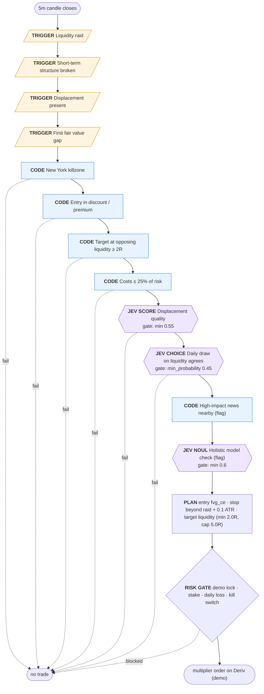

# ICT 2022 Mentorship model — raid, shift, FVG (v1, draft)

Liquidity is raided, displacement breaks the short-term structure the other way and leaves a fair value gap; enter on the return to the first FVG inside the New York killzone, stop beyond the raid, target the opposing liquidity. Draft v1 written from keyword-retrieved transcript passages (episodes 1-21); to be refined against the Jev-tagged digest.

## Nodes

| # | Node | Kind | Rule | ICT source |
|---|---|---|---|---|
| 1 | **Liquidity raid** | trigger | Price runs below sell-side liquidity (swing low, previous-day low, Asian low) for longs, or above buy-side liquidity for shorts. | [2022 ICT Mentorship Episode 16 @37:07](https://www.youtube.com/watch?v=EpGQnhjXBq8&t=2227s) [2022 ICT Mentorship Episode 12 @72:01](https://www.youtube.com/watch?v=8GkQfdAXZP0&t=4321s) |
| 2 | **Short-term structure broken** | trigger | Within 24 bars of the raid, a candle closes beyond the last short-term swing that preceded the raid. | [2022 ICT Mentorship Episode 12 @37:27](https://www.youtube.com/watch?v=8GkQfdAXZP0&t=2247s) [2022 ICT Mentorship Episode 3 @2:34](https://www.youtube.com/watch?v=nQfHZ2DEJ8c&t=154s) |
| 3 | **Displacement present** | trigger | The move from the raid contains at least one candle whose body is ≥ 1.2 × ATR. | [2022 ICT Mentorship Episode 11 @17:36](https://www.youtube.com/watch?v=Sqw2bww93Zo&t=1056s) [2022 ICT Mentorship Episode 11 @19:11](https://www.youtube.com/watch?v=Sqw2bww93Zo&t=1151s) |
| 4 | **First fair value gap** | trigger | The first fair value gap left inside the displacement leg (at most 2 bars after the shift) arms the setup. | [2022 ICT Mentorship Episode 16 @22:37](https://www.youtube.com/watch?v=EpGQnhjXBq8&t=1357s) [2022 ICT Mentorship Episode 12 @37:27](https://www.youtube.com/watch?v=8GkQfdAXZP0&t=2247s) |
| 5 | **New York killzone** | code | The structure break happens 07:00–10:00 New York time for forex, 08:30–11:00 for indices. | [2022 ICT Mentorship Episode 17 @13:37](https://www.youtube.com/watch?v=5WIqHJDQ_p4&t=817s) [2022 ICT Mentorship Episode 17 @24:23](https://www.youtube.com/watch?v=5WIqHJDQ_p4&t=1463s) |
| 6 | **Entry in discount / premium** | code | Longs enter at or below 50% of the displacement leg (discount); shorts at or above 50% (premium). | [2022 ICT Mentorship Episode 10 @4:09](https://www.youtube.com/watch?v=S9ORTYmXwdE&t=249s) |
| 7 | **Target at opposing liquidity ≥ 2R** | code | The nearest opposing liquidity beyond the leg must pay at least 2× the risk (capped at 5R). | [2022 ICT Mentorship Episode 13 @6:47](https://www.youtube.com/watch?v=tpPtItWqmlg&t=407s) [2022 ICT Mentorship Episode 10 @22:07](https://www.youtube.com/watch?v=S9ORTYmXwdE&t=1327s) |
| 8 | **Costs ≤ 25% of risk** | code | Execution realism, not ICT doctrine: on 5-minute charts stops can be a few pips, where Deriv spread + commission would consume most of 1R. Rejects setups whose round-trip cost exceeds 25% of the risk. | — |
| 9 | **Displacement quality** | jev | Jev grades the displacement from facts code computed (body/ATR, closes near extreme, candle count). Fallback: normalised body/ATR ≥ 0.3. | [2022 ICT Mentorship Episode 11 @19:11](https://www.youtube.com/watch?v=Sqw2bww93Zo&t=1151s) |
| 10 | **Daily draw on liquidity agrees** | jev | Trade only in the direction of the daily draw. Fallback rule: follow the previous day's close direction. | [2022 ICT Mentorship Episode 12 @7:50](https://www.youtube.com/watch?v=8GkQfdAXZP0&t=470s) [2022 ICT Mentorship Episode 11 @13:44](https://www.youtube.com/watch?v=Sqw2bww93Zo&t=824s) |
| 11 | **High-impact news nearby (flag)** | code (flag) | Flags setups within ±15 min of high-impact news for the pair's currencies. ICT does not avoid news outright, so this flags rather than rejects. | [2022 ICT Mentorship Episode 17 @25:23](https://www.youtube.com/watch?v=5WIqHJDQ_p4&t=1523s) |
| 12 | **Holistic model check (flag)** | jev (flag) | A sanity judgment over the whole setup; it only flags, so it can be measured before it is trusted. | — |
