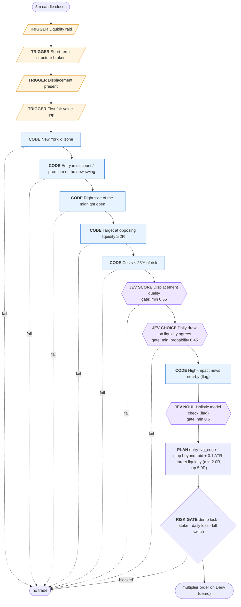

# ICT 2022 Mentorship model — raid, shift, FVG (Jev-refined) (v3, draft)

Liquidity is raided; displacement breaks short-term structure the other way and leaves a fair value gap. Enter at the gap's edge in the discount (long) / premium (short) half of the swing just created, on the right side of the NY midnight opening price, inside the New York killzone; unfilled orders are pulled at 11:30 NY. Stop 5 pips beyond the raid; target the opposing liquidity. v3 rules come from the top Jev-ranked passages of episodes 1-21 (710 tagged windows).

## Nodes

| # | Node | Kind | Rule | ICT source |
|---|---|---|---|---|
| 1 | **Liquidity raid** | trigger | Price runs below sell-side liquidity (swing low, previous-day low, Asian low) for longs, or above buy-side liquidity for shorts. | [2022 ICT Mentorship Episode 2 @47:22](https://www.youtube.com/watch?v=tmeCWULSTHc&t=2842s) [2022 ICT Mentorship Episode 16 @37:07](https://www.youtube.com/watch?v=EpGQnhjXBq8&t=2227s) [2022 ICT Mentorship Episode 12 @72:01](https://www.youtube.com/watch?v=8GkQfdAXZP0&t=4321s) |
| 2 | **Short-term structure broken** | trigger | Within 24 bars of the raid, a candle closes beyond the last short-term swing that preceded the raid. | [2022 ICT Mentorship Episode 12 @37:27](https://www.youtube.com/watch?v=8GkQfdAXZP0&t=2247s) [2022 ICT Mentorship Episode 3 @2:34](https://www.youtube.com/watch?v=nQfHZ2DEJ8c&t=154s) |
| 3 | **Displacement present** | trigger | The move from the raid contains at least one candle whose body is ≥ 1.2 × ATR. | [2022 ICT Mentorship Episode 11 @17:36](https://www.youtube.com/watch?v=Sqw2bww93Zo&t=1056s) [2022 ICT Mentorship Episode 11 @19:11](https://www.youtube.com/watch?v=Sqw2bww93Zo&t=1151s) |
| 4 | **First fair value gap** | trigger | The first fair value gap left inside the displacement leg (at most 2 bars after the shift) arms the setup. | [2022 ICT Mentorship Episode 16 @22:37](https://www.youtube.com/watch?v=EpGQnhjXBq8&t=1357s) [2022 ICT Mentorship Episode 12 @37:27](https://www.youtube.com/watch?v=8GkQfdAXZP0&t=2247s) |
| 5 | **New York killzone** | code | The structure break happens 07:00–10:00 New York time for forex, 08:30–11:00 for indices. | [2022 ICT Mentorship Episode 17 @13:37](https://www.youtube.com/watch?v=5WIqHJDQ_p4&t=817s) [2022 ICT Mentorship Episode 17 @24:23](https://www.youtube.com/watch?v=5WIqHJDQ_p4&t=1463s) [2022 ICT Mentorship Episode 18 @31:41](https://www.youtube.com/watch?v=eai0nHhAC8w&t=1901s) |
| 6 | **Entry in discount / premium of the new swing** | code | Longs enter at or below 50% of the swing just created (raid extreme to displacement extreme); shorts at or above 50%. v2 used the previous-day range, a misreading of Ep. 10, which is about daily bias. | [2022 ICT Mentorship Episode 2 @47:22](https://www.youtube.com/watch?v=tmeCWULSTHc&t=2842s) [2022 ICT Mentorship Episode 11 @1:21](https://www.youtube.com/watch?v=Sqw2bww93Zo&t=81s) |
| 7 | **Right side of the midnight open** | code | Shorts sell above the NY midnight opening price, longs buy below it (daily premium/discount relative to the open). | [2022 ICT Mentorship Episode 10 @17:59](https://www.youtube.com/watch?v=S9ORTYmXwdE&t=1079s) [2022 ICT Mentorship Episode 16 @15:24](https://www.youtube.com/watch?v=EpGQnhjXBq8&t=924s) |
| 8 | **Target at opposing liquidity ≥ 2R** | code | The nearest opposing liquidity beyond the leg must pay at least 2× the risk (capped at 5R). | [2022 ICT Mentorship Episode 13 @6:47](https://www.youtube.com/watch?v=tpPtItWqmlg&t=407s) [2022 ICT Mentorship Episode 10 @22:07](https://www.youtube.com/watch?v=S9ORTYmXwdE&t=1327s) |
| 9 | **Costs ≤ 25% of risk** | code | Execution realism, not ICT doctrine: on 5-minute charts stops can be a few pips, where Deriv spread + commission would consume most of 1R. Rejects setups whose round-trip cost exceeds 25% of the risk. | — |
| 10 | **Displacement quality** | jev | Jev grades the displacement from facts code computed (body/ATR, closes near extreme, candle count). Fallback: normalised body/ATR ≥ 0.3. | [2022 ICT Mentorship Episode 11 @19:11](https://www.youtube.com/watch?v=Sqw2bww93Zo&t=1151s) |
| 11 | **Daily draw on liquidity agrees** | jev | Trade only toward the daily draw on liquidity. Jev judges it from the daily facts, including whether the previous day high/low has already traded today. Fallback rule (v2): the opposing previous-day extreme must still be resting, untaken today. | [2022 ICT Mentorship Episode 12 @7:50](https://www.youtube.com/watch?v=8GkQfdAXZP0&t=470s) [2022 ICT Mentorship Episode 11 @13:44](https://www.youtube.com/watch?v=Sqw2bww93Zo&t=824s) |
| 12 | **High-impact news nearby (flag)** | code (flag) | Flags setups within ±15 min of high-impact news for the pair's currencies. ICT does not avoid news outright, so this flags rather than rejects. | [2022 ICT Mentorship Episode 17 @25:23](https://www.youtube.com/watch?v=5WIqHJDQ_p4&t=1523s) |
| 13 | **Holistic model check (flag)** | jev (flag) | A sanity judgment over the whole setup; it only flags, so it can be measured before it is trusted. | — |

## Execution rules — ICT sources

- [2022 ICT Mentorship Episode 20 @14:01](https://www.youtube.com/watch?v=Q6GFu8-Z4rY&t=841s): your fill here, maybe one pipette… or a full pip above this candle's high, would be your entry
- [2022 ICT Mentorship Episode 9 @21:42](https://www.youtube.com/watch?v=iZLXnNiZm_s&t=1302s): a buyer on a limit… the short-term low after the fair value gap forms is where your stop loss is
- [2022 ICT Mentorship Episode 17 @21:52](https://www.youtube.com/watch?v=5WIqHJDQ_p4&t=1312s): fluff up your excess with five pips, and if you're really new just use 10 pips
- [2022 ICT Mentorship Episode 18 @48:06](https://www.youtube.com/watch?v=eai0nHhAC8w&t=2886s): if it doesn't fill you by 11:30, pull the order

## Changelog

- v1 (2026-09-23): initial draft from keyword retrieval over episodes 1-21; Jev-tagged digest refinement pending.
- v2 (2026-09-23): premium/discount measured on the previous-day dealing range (the daily range cited in Ep. 10 @4:09) instead of the displacement leg.
- v2 (2026-09-23): htf_draw fallback uses the untaken opposing previous-day extreme (v1's 'follow the previous close' contradicted the daily-discount rule); Jev now sees whether PDH/PDL already traded today.
- v3 (2026-09-23): rules re-derived from the top Jev-ranked passages. Premium/discount back on the new swing (Ep. 2 @47:22); new opening-price node (Ep. 10 @17:59, Ep. 16 @15:24); entry at the FVG edge (Ep. 20), 5-pip stop buffer (Ep. 17), entries pulled at 11:30 NY (Ep. 18); Jev pinned to jev-1.13.0.
- v3 (2026-09-26): added two question_variants per judge node and ensemble weights (Jev 0.6 / Laya 0.4, threshold 0.6); code and single-judge modes are unchanged.
